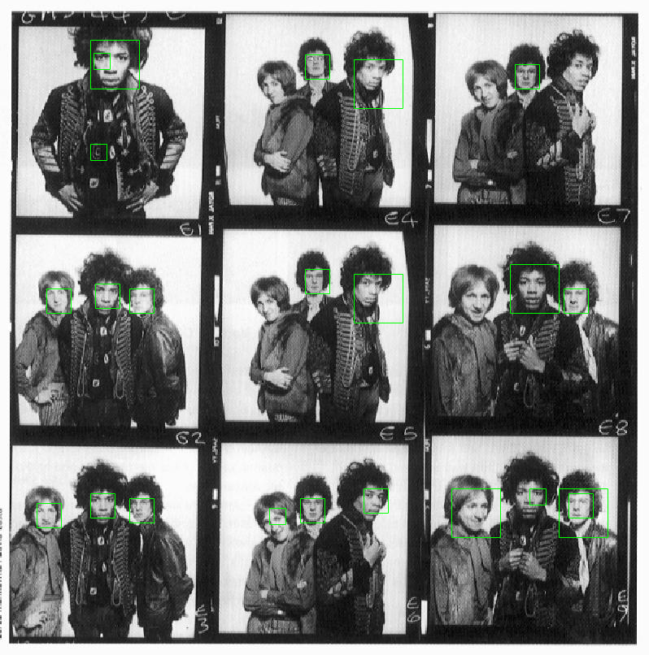
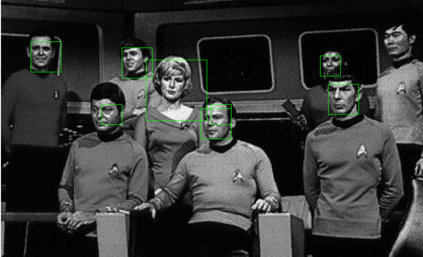
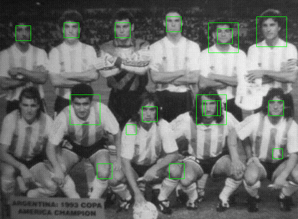
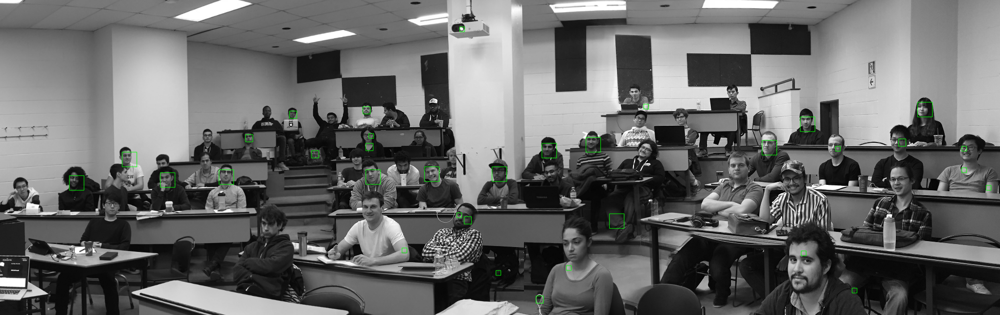

# MATLAB Face Detector

## Overview
This is a face detector built for a class on computer vision. It uses HOG features to train an SVM, both of which are provided through the VLFeat library. It then uses a sliding window function for face detection on larger images, preventing overlapping boxes through mean IoU and non-max suppression. Multi-scale detection is implemented across 3 scales.

## Dataset
The dataset originally was composed of approximately 14,000 36x36 images evenly split between faces and non-faces. I added data augmentation in the form of left-right flipping, up-down flipping, intensity scaling, and addition of noise. The scripts for augmenting the dataset are in `generate_faces.m` and `generate_cropped_notfaces.m`.

## Training

The SVM can be trained on HOG features using `train_svm`. The SVM uses Stochastic Gradient Descent as its solver with L1 regularization. Cross-fold validation is done for training the SVM and tuning the `lambda` hyper-parameter. The final SVM is stored as `mysvm.mat`.

## Detection

For running the detector, we use a sliding window function to establish candidate boxes in the image. The image is taken at its original scale as well as half and double scales to ensure detection is multi-scale. Image scales can be added as needed in `detect`. To avoid overlapping detections we use mean IoU and suppress non-maximum responses. 

## Running

To run, first load the SVM weights with `load('mysvm.mat')`
To run on an example image provided in this repo, run `detect_class`. 
In general, you can run `detect`, as long as the `imageDir` variable in `detect.m` is set to the correct one.

## Examples

